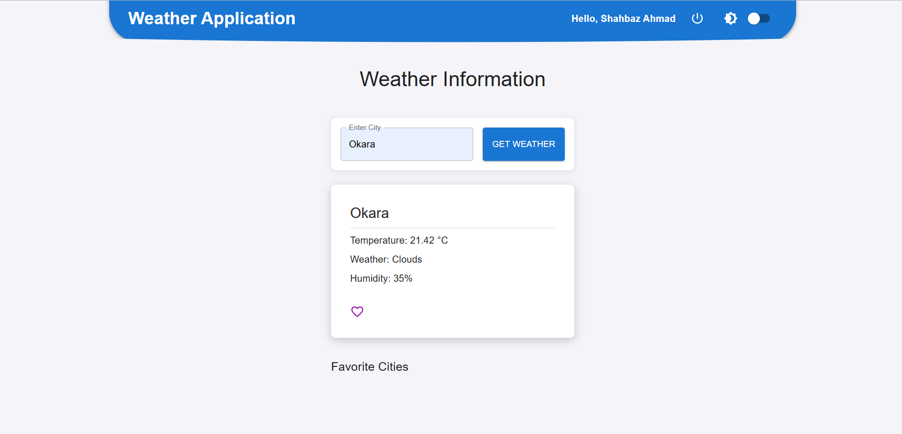

# Weather Application

A responsive weather application built with React and Material-UI. The app allows users to search for the current weather of a city and add favorite cities. It also supports user authentication with Google OAuth and offers a theme toggle for dark and light modes.

## Features

- **City Weather Search**: Users can search for the current weather of a city.
- **Favorite Cities**: Users can save cities as favorites for quick access.
- **Google Authentication**: Users can log in with Google OAuth.
- **Responsive Design**: The app is fully responsive, adapting to various screen sizes.
- **Dark/Light Theme Toggle**: Users can switch between dark and light themes.
- **Error Notifications**: Backend errors (e.g., 404, 500) are displayed as notifications for better user feedback.

## Screenshot




## Tech Stack

- **Frontend**: React, Material-UI
- **Backend**: Node.js, Express.js, MongoDB 
- **Authentication**: Google OAuth
- **API**: OpenWeather API for weather data

## Installation

### Prerequisites

- Node.js
- npm
- OpenWeather API key
- Google OAuth Client ID

### Steps

1. Clone the repository:
   ```bash
   git clone https://github.com/shahbazraza606/weather_app.git
   cd weather-application
2. Frontend

    ```bash
    cd frontend
    npm start
3. Backend
   Env file is already pushed for your easy to use testing
   ```bash
   cd backend
   npm start
